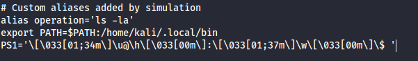
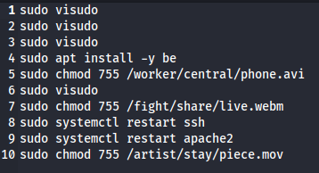
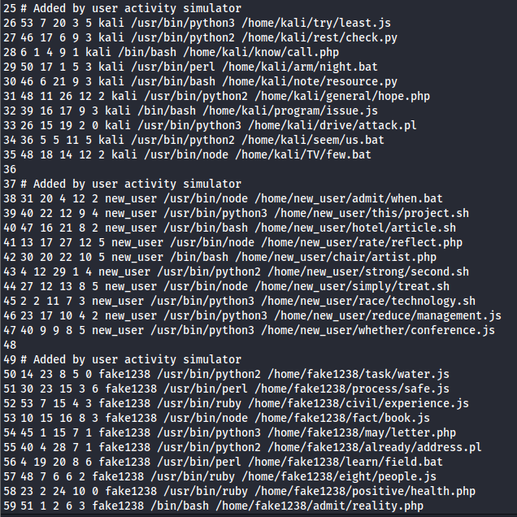
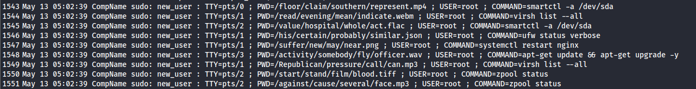
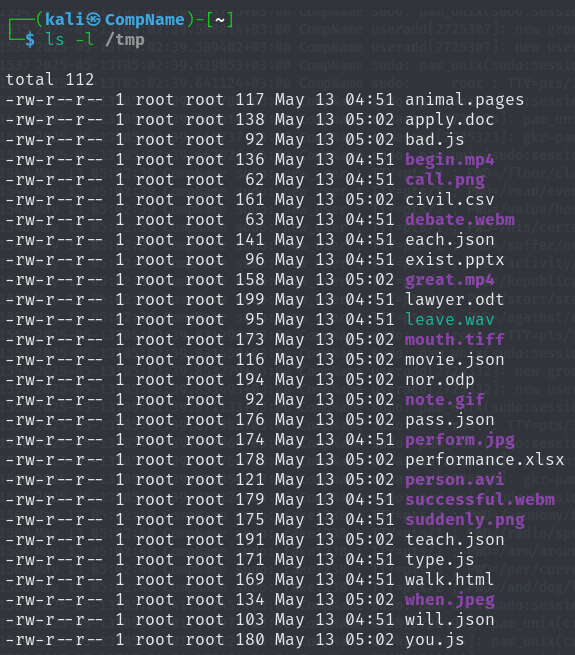

# TruxTrace

- **TruxTrace** is a powerful Linux user simulation tool designed to emulate realistic command-line behavior for single and multiple users. It enables analysts, developers, and educators to simulate Linux user activity, generate forensic artifacts, and test scenarios in a safe, controlled environment.
<p align="center">
  
</p>

## 🐧 Why the Name?

- **Tux**: The Linux mascot, representing the open-source spirit and system TruxTrace is built for.
- **Trace**: Emphasizes the tool’s goal, simulating and tracing user behavior for deeper insight, testing, or forensic purposes.

---

## 🔍 What is TruxTrace?

TruxTrace simulates user interactions with a Linux system executing commands, navigating the filesystem, scheduling cron jobs, and more. It's especially useful for:

- **Digital Forensics**: Generate realistic artifacts (e.g., `.bash_history`, syslogs) to test forensic tools.
- **Security Training**: Demonstrate attacker or admin behavior in a sandboxed environment.
- **DevOps & QA**: Simulate user activity to test monitoring and logging pipelines.
- **Education**: Teach Linux CLI behavior without needing real users.

---

## 🚀 Features

- Simulates single and multi-user Linux activity
- Supports command execution, file system interactions, and cron jobs
- Creates realistic artifacts (e.g., `.bash_history`, `/var/log` entries)
- User profiles: Admin, Developer, Sysadmin, General
- Docker and manual installation support
- Useful in digital forensics and education

---

## 📦 Installation

### Manual Install
```bash
git clone https://github.com/MohamedMostafa010/TuxTrace/tree/main
cd truxtrace
python3 -m venv venv
source venv/bin/activate
pip install -r requirements.txt
python3 TuxTrace.py
```

### Docker Install
```bash
docker build -t truxtrace .
docker run --rm -it \
  --privileged \
  -v /etc:/etc \
  -v /home:/home \
  -v /var/log:/var/log \
  -v /tmp:/tmp \
  tuxtrace
```
---

## 🔧 Quick Start
- After running the script, you will see the following:
```bash
┌──(kali㉿CompName)-[~/Desktop/Main]
└─$ sudo python3 TuxTrace.py
                                                                                                                                                                                            
                                                  _________  ___  ___     ___    ___ _________  ________  ________  ________  _______                                                       
                                                 |\___   ___\\  \|\  \   |\  \  /  /|\___   ___\\   __  \|\   __  \|\   ____\|\  ___ \                                                      
                                                 \|___ \  \_\ \  \\\  \  \ \  \/  / ||___ \  \_\ \  \|\  \ \  \|\  \ \  \___|\ \   __/|                                                     
                                                      \ \  \ \ \  \\\  \  \ \    / /     \ \  \ \ \   _  _\ \   __  \ \  \    \ \  \_|/__                                                   
                                                       \ \  \ \ \  \\\  \  /     \/       \ \  \ \ \  \\  \\ \  \ \  \ \  \____\ \  \_|\ \                                                  
                                                        \ \__\ \ \_______\/  /\   \        \ \__\ \ \__\\ _\\ \__\ \__\ \_______\ \_______\                                                 
                                                         \|__|  \|_______/__/ /\ __\        \|__|  \|__|\|__|\|__|\|__|\|_______|\|_______|                                                 
                                                                         |__|/ \|__|                                                                                                        
                                                                                                                                                                                            
[*] This script simulates user activity and generates forensic artifacts.

--- --- --- ---

==> Simulation mode (single/multi):
```
- Follow the prompt to:
  - Choose simulation mode (single or multi)
  - Select user profile(s)
  - Let the simulation run
  - Review the generated artifacts
- Sample when filling the required:
```bash
==> Simulation mode (single/multi): single
==> Number of commands to simulate (default 50): 100
==> Number of sudo commands to simulate (default 10): 100
==> Number of cron jobs to add (default 3): 100
==> Username to simulate (default kali): fake1_user
==> User profile (admin/developer/sysadmin/general): developer
User fake1_user not found - creating...
Created user fake1_user with home directory /home/fake1_user

[*] Note: Some operations require sudo privileges. You may be prompted for your password.

[*] Starting simulation...

[*] Simulating 100 commands for developer user fake1_user...
[*] Customizations added to /home/fake1_user/.bashrc
[*] Simulation complete. Artifacts generated:
     - 100 commands added to /home/fake1_user/.bash_history
     - 50 sudo commands logged to /var/log/auth.log
     - 100 cron jobs added to /etc/crontab
     - Customizations added to /home/fake1_user/.bashrc
     - Temporary files written to /tmp
```
---

## 👨🏻‍💻 User Profiles
- Each user profile simulates distinct behavior patterns and command usage:

| Profile   | Description                                             |
| --------- | ------------------------------------------------------- |
| **Admin**     | Root-level operations, system config, user management   |
| **Developer** | Git, editors (vim, nano), build tools, code compilation |
| **Sysadmin**  | Service control, package installs, log inspection       |
| **General**   | Basic file navigation, utilities, browsing activity     |

---

## 🕵🏻‍♀️ Digital Forensics Use Case
- TruxTrace is widely used in digital forensics training and research. It creates simulated but realistic traces of user activity, which can be analyzed using forensic tools to test:
  - Timeline analysis
  - File and log correlation
  - Intrusion detection simulations
 
---

## 📸 Output Screenshots

## .bashrc File Modifications: 
<p align="center">
  
</p>

## .bash_history File Modifications:
<p align="center">
  
</p>

## crontab File Modifications:
<p align="center">
  
</p>

## auth.log File Modifications:
<p align="center">
  
</p>

## tmp Directory Modifications:
<p align="center">
  
</p>

---

## 🤝 Contributing
- Pull requests are welcome! If you have ideas for new user profiles, simulation modes, or forensic artifacts, feel free to contribute.
